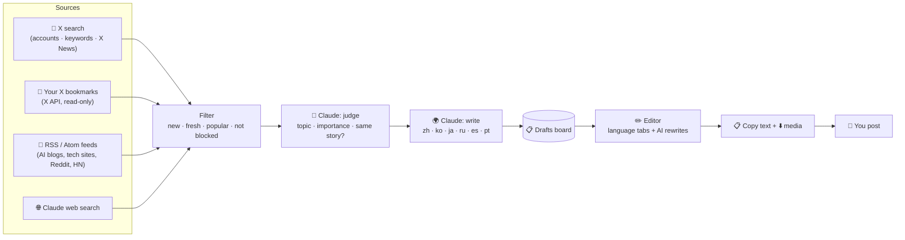

<div align="center">

# 🤖 Content Machine

**Turn your X bookmarks and the latest AI news into ready-to-post social posts in six languages, with Claude doing the heavy lifting.**

You pick what's worth sharing. Claude finds the news and writes each post in 🇨🇳 Chinese, 🇰🇷 Korean, 🇯🇵 Japanese, 🇷🇺 Russian, 🇪🇸 Spanish and 🇧🇷 Portuguese. You review, tweak, copy and post.


[Features](#-features) · [How it works](#-how-it-works) · [Quick start](#-quick-start) · [Daily workflow](#-daily-workflow) · [Configuration](#%EF%B8%8F-configuration) · [Troubleshooting](#-troubleshooting)

</div>

---

## ✨ Features

- **🔖 X bookmarks → drafts.** Scroll X like you always do and bookmark the AI posts worth sharing. One click imports the new bookmarks, and Claude sorts each one into your topics and writes it in every language.
- **🔎 Popular X posts.** For each topic, the app searches X for posts from the accounts you watch (e.g. @OpenAI, @sama), keyword matches above your minimum likes, and **X News** trending stories, all through X's official MCP server.
- **📰 Free AI news discovery.** For every topic you track (OpenAI, Claude, open-source models, AI agents…), the app reads RSS feeds (company blogs, tech sites, Reddit, Hacker News) and runs a Claude web search. Claude keeps only real news, merges duplicates of the same story and skips what you already have.
- **🌍 Six languages at once.** Every draft is written natively in 中文, 한국어, 日本語, Русский, Español and Português, adapted to how each audience talks about tech, not translated word for word. Turn languages on or off in Settings.
- **✍️ An editor that helps.** Switch between language tabs, edit by hand, or ask the AI: *“make it shorter”*, *“explain the technical terms simply”*, *“mention it's free for students”*. You can ask in any language and the post stays in its own. Every change is saved as a version.
- **📋 Built for posting by hand.** Each post has a character counter (500 by default, Threads' limit), **Copy text**, **Download media** (all images and videos as one zip) and **Mark posted**.
- **🧠 AI on your Claude subscription.** By default the AI runs through Claude Code on your own computer, so there's no per-token API bill.
- **🔒 Local and private.** Drafts, settings and media stay in a SQLite file on your machine. Nothing is ever posted for you.

> [!NOTE]
> Content Machine **never posts anything** on X, Threads or anywhere else. Publishing stays in your hands, which keeps your accounts safe from automation bans.

---

## 🧭 How it works



| Step | What happens |
|---|---|
| **1. Collect** | **Import bookmarks** pulls your newest X bookmarks and stops at the first one it already has. **Find news** reads your feeds and asks Claude to search the web for each topic. |
| **2. Filter** | Duplicates, items already seen, items older than your limit and anything on your blocklist are dropped. |
| **3. Judge** | Claude rates each item 1–10, matches it to a topic and groups items about the same story so you get one draft per story. Bookmarks are always kept, because you chose them. |
| **4. Write** | For each kept item, Claude writes a native-sounding post in every enabled language, within your character limit and in your style. |
| **5. Review & post** | Drafts appear on the board with the original, your languages, media and Claude's reason for picking it. Polish, copy, post and mark as posted. |

---

## 💸 What it costs

| Part | Cost |
|---|---|
| 🧠 AI (judging, writing in 6 languages, edits, web search) | **Included in your Claude plan.** Uses your plan's monthly Agent SDK credit |
| 📰 RSS feeds | **Free** |
| 🔖 X bookmark import | **~$0.001 per bookmark** from X API credits. New X developer accounts get $20 in free credits |
| 🔎 X post search *(optional, off by default)* | ~$0.005 per post read. One run with 3 accounts and 30 posts per query is about $0.15–0.30 per topic |

Importing 300 bookmarks a month costs about **$0.30**.

---

## 📦 Requirements

| | |
|---|---|
| **Computer** | macOS, Linux or Windows (WSL recommended) |
| **Node.js** | **22 or newer** (check with `node -v`) |
| **Claude Code** | Installed and logged in with a Claude subscription (Pro or Max). See the [Claude Code docs](https://code.claude.com/docs) |
| **X developer account** | Optional, only needed for bookmark import ([console.x.com](https://console.x.com)) |

---

## 🚀 Quick start

### 1. Get the code

```bash
git clone https://github.com/RamazanBolatkhan/content_machine.git
cd content_machine
npm install
```

### 2. Make sure Claude Code is ready

```bash
claude --version   # should print a version
claude             # run once and log in with your Claude account, then exit
```

### 3. Create your config file

```bash
cp .env.example .env.local
```

The defaults already use Claude Code, so you can leave the file as it is for now.

### 4. Start the app

```bash
npm run dev
```

Open **[http://127.0.0.1:3000](http://127.0.0.1:3000)**. Open **Settings**: under *Connections* it should say **✅ Claude Code on your subscription**.

> [!TIP]
> Always open the app at `127.0.0.1:3000`, not `localhost:3000`. X login only accepts the exact address you register.

The database (`data/app.db`) is created automatically on first start.

---

## 🔖 Connect X (for bookmarks)

This step is optional. Without it, you can still use **Find news**.

1. Go to **[console.x.com](https://console.x.com)**, sign in, accept the developer terms and create an **App**.
2. Open the app's **User authentication settings** and set:

   | Setting | Value |
   |---|---|
   | App permissions | **Read** |
   | Type of app | **Native App** *(or Web App, if you also copy the Client Secret)* |
   | Callback URL | `http://127.0.0.1:3000/api/x/callback` |
   | Website URL | anything, e.g. your X profile link |

3. Copy the **OAuth 2.0 Client ID** into `.env.local`:

   ```bash
   X_CLIENT_ID=your_client_id
   # X_CLIENT_SECRET=only_for_web_app_type
   ```

4. Add some API credits in the console. Bookmark reads are billed per post.
5. Restart `npm run dev`, then go to **Settings → Connect X account** and approve.

The app asks only for read access: `tweet.read`, `users.read`, `bookmark.read`, plus `offline.access` to stay logged in.

---

## 🎯 Add your topics

Go to **Settings → Topics to track** and add one card per thing you post about.

| Field | What to put in | Example |
|---|---|---|
| **Topic** | A company, product or theme | `OpenAI` |
| **Keywords** | Names people use for it, one per line. Used by web search and to match general news feeds | `OpenAI`<br>`ChatGPT`<br>`Sam Altman` |
| **Feeds** | RSS/Atom feeds that are *only* about this topic, one per line | `https://openai.com/news/rss.xml` |
| **X accounts to watch** | X handles whose posts matter for this topic (used by X search) | `OpenAI`<br>`sama`<br>`OpenAIDevs` |

> [!TIP]
> For X search, **accounts to watch are the key.** X's API has no "popular only" filter, so a keyword search mostly returns posts with a handful of likes, and the app drops anything below your minimum. Posts from the accounts you watch are popular by nature.

**Topic ideas:** `OpenAI` · `Anthropic & Claude` · `Google Gemini` · `Open-source models` · `AI agents` · `AI image & video`

**Feeds that work well** (tested):

| Source | Feed URL | Best as |
|---|---|---|
| OpenAI News | `https://openai.com/news/rss.xml` | topic feed |
| Google DeepMind | `https://deepmind.google/blog/rss.xml` | topic feed |
| Google AI blog | `https://blog.google/technology/ai/rss/` | topic feed |
| Hugging Face blog | `https://huggingface.co/blog/feed.xml` | topic feed (open source) |
| r/LocalLLaMA (top of the day) | `https://www.reddit.com/r/LocalLLaMA/top/.rss?t=day` | topic feed (open source) |
| TechCrunch AI | `https://techcrunch.com/category/artificial-intelligence/feed/` | general feed |
| The Verge AI | `https://www.theverge.com/rss/ai-artificial-intelligence/index.xml` | general feed |
| MIT Technology Review AI | `https://www.technologyreview.com/topic/artificial-intelligence/feed` | general feed |
| Hacker News (popular AI posts) | `https://hnrss.org/newest?q=AI+OR+LLM&points=100` | general feed |

Put **general feeds** under **Settings → Sources → General AI news feeds**. Their articles are matched to your topics by keyword. Companies without an RSS feed (e.g. Anthropic) are still covered by Claude web search.

**More recipes:** any subreddit `https://www.reddit.com/r/<NAME>/top/.rss?t=day` · any YouTube channel `https://www.youtube.com/feeds/videos.xml?channel_id=<ID>` · most blogs `https://<site>/feed`

---

## 📅 Daily workflow

1. **Scroll X** as usual and **bookmark** AI posts worth sharing.
2. Open the **Drafts** board and press:
   - **📥 Import bookmarks** to turn your new bookmarks into drafts.
   - **🔎 Find posts & news** to collect popular X posts and fresh news for all topics, or pick one topic from the list.

   A run takes about 1–3 minutes per topic.
3. Go through the **New** tab. Every card shows the topic, the source, Claude's importance score (⭐ 1–10), why Claude picked it, and which languages are ready (🇨🇳 ZH 🇰🇷 KO 🇯🇵 JA …). Use **Show cards in:** to read the cards in the original or in any of your languages.
4. Click **✏️ Open editor** on a good one:
   - Switch between **language tabs**.
   - Edit by hand, or use the quick buttons (*Make it shorter*, *Explain the technical terms simply*…) or your own request.
   - Missing a language? Press **✨ Write missing languages**.
   - Use **Version history** to go back to any earlier version of that language.
5. **📋 Copy text**, **⬇️ Download media**, post it, and press **📤 Mark posted**.

> [!TIP]
> Credit the original author or outlet in your post (e.g. *“Source: OpenAI”*). The editor reminds you of the right name.

### Run it on a timer (optional)

```bash
npm run scout:loop -- 240   # import bookmarks + find news every 240 minutes
```

This keeps running while the terminal window is open.

---

## ⚙️ Configuration

### Environment (`.env.local`)

| Variable | Default | What it does |
|---|---|---|
| `AI_PROVIDER` | `claude-code` | `claude-code` uses your local Claude Code (subscription). `gateway` uses [Vercel AI Gateway](https://vercel.com/ai-gateway) (paid per token) |
| `CLAUDE_MODEL` | `sonnet` | Claude Code model alias: `sonnet`, `opus` or `haiku` |
| `CLAUDE_BIN` | auto-detected | Path to `claude`, only if the app can't find it |
| `AI_GATEWAY_API_KEY` | – | Only when `AI_PROVIDER=gateway` |
| `AI_MODEL` | `anthropic/claude-sonnet-5.5` | Gateway model, only when `AI_PROVIDER=gateway` |
| `X_CLIENT_ID` | – | OAuth 2.0 Client ID of your X app (for bookmarks) |
| `X_CLIENT_SECRET` | – | Only for X apps of type *Web App* |
| `X_REDIRECT_URI` | `http://127.0.0.1:3000/api/x/callback` | Change it if you run on another port |
| `X_BEARER_TOKEN` | – | For X post search (Bearer Token from your X app's *Keys and tokens*) |

### In-app settings

| Section | Settings |
|---|---|
| **Sources** | Turn RSS, Claude web search and paid X search on or off. Set general AI news feeds, the max bookmarks per import, ignore news older than N hours, and the max items per topic sent to the AI |
| **Languages** | Pick which of the six languages to write in, and the **max characters per post**: 500 for Threads, 280 for X without Premium |
| **Writing & filters** | **Style**, written in any language and applied to all of them. **Glossary**: terms never translated, e.g. `fine-tuning`, `open-source`. **Blocklist**: words or `@handles` to always skip |
| **Recent runs** | A log of every import and news run, with warnings such as a broken feed |

> [!NOTE]
> Want another language? Add it to the list in [`src/lib/languages.ts`](src/lib/languages.ts). It then appears in Settings and the editor automatically.

---

## 🧰 Commands

| Command | What it does |
|---|---|
| `npm run dev` | Start the app at `http://127.0.0.1:3000` |
| `npm run build` / `npm start` | Production build and run (still local) |
| `npm run scout:loop -- <minutes>` | Collect automatically on a timer |
| `npm run typecheck` | TypeScript check |
| `npm run lint` | ESLint |
| `npm run db:generate` | Create a migration after changing `src/db/schema.ts` |
| `npm run x:check -- "<query>"` | Test the optional paid X search connection |

---

## 🗂️ Project structure

```
content_machine/
├── src/
│   ├── app/                    # Pages (Drafts, Editor, Settings) + API routes
│   │   ├── api/x/              #   X login (OAuth) + callback
│   │   └── api/drafts/[id]/    #   AI edit + media zip
│   ├── components/             # Board buttons, multilingual editor, media grid…
│   ├── db/schema.ts            # SQLite tables (Drizzle ORM)
│   └── lib/
│       ├── agents/scout.ts     # Collect → filter → judge → save
│       ├── agents/writer.ts    # Writes each post in every enabled language
│       ├── agents/editor.ts    # AI rewrites + "write missing languages"
│       ├── languages.ts        # The six languages (add more here)
│       ├── claude-cli.ts       # Runs `claude -p` on your subscription
│       ├── ai.ts               # AI provider switch + writing rules
│       ├── sources/            # RSS reader, Claude web search
│       └── x/                  # X OAuth, bookmarks, optional search
├── scripts/                    # scout-loop, x-check
├── drizzle/                    # Database migrations (applied automatically)
├── docs/PROJECT_SCHEME.md      # Design notes and decisions
└── data/                       # Your database + media (git-ignored)
```

---

## 🩺 Troubleshooting

<details>
<summary><b>Settings says “Claude Code CLI not found”</b></summary>

Install Claude Code and run `claude` once to log in. If it's installed in an unusual place, find it with `which claude` and add the path to `.env.local`:

```bash
CLAUDE_BIN=/full/path/to/claude
```
Then restart `npm run dev`.
</details>

<details>
<summary><b>“Claude error … usage limit” during a run</b></summary>

Your plan's monthly Agent SDK credit is used up, or you've hit a rate limit. You can:
- wait for it to reset,
- write in fewer languages,
- lower **Max news items per topic**,
- or turn off **Claude web search** for a while (RSS keeps working).
</details>

<details>
<summary><b>A draft is missing some languages</b></summary>

Writing sometimes fails for one item (e.g. a timeout). Open the draft and press **✨ Write missing languages**. The same button helps after you turn on a new language in Settings.
</details>

<details>
<summary><b>X login fails or says the callback URL doesn't match</b></summary>

- Open the app at **`http://127.0.0.1:3000`**, not `localhost`.
- The callback URL in the X console must be exactly `http://127.0.0.1:3000/api/x/callback`.
- *Native App* type: set only `X_CLIENT_ID`. *Web App* type: also set `X_CLIENT_SECRET`.
- Restart `npm run dev` after changing `.env.local`.
</details>

<details>
<summary><b>Bookmark import fails with 402 / 403</b></summary>

Your X developer account has no credits left, or the app lacks read permission. Add credits in [console.x.com](https://console.x.com), check **App permissions → Read**, then use **Disconnect** and **Connect X account** again in Settings.
</details>

<details>
<summary><b>A feed shows “429 Too Many Requests” or another error</b></summary>

The site refused the request for now, which is common with Reddit. Only that feed is skipped for the run, and the next run usually works. A permanent error means the URL isn't an RSS/Atom feed; open it in a browser to check.
</details>

<details>
<summary><b>“Find news” finds nothing new</b></summary>

That usually means there's no fresh news. To get more:
- add more feeds,
- add more keywords for the topic,
- or raise **Ignore news older than**.

Items Claude already judged are never shown again.
</details>

<details>
<summary><b>I want to start over with an empty database</b></summary>

Stop the app and delete the `data/` folder. It's created again on the next start. This deletes all drafts and settings.
</details>

---

## 🛡️ Responsible use

- **No scraping.** Content from X comes only through the official X API, and only from **your own bookmarks**. X's terms forbid scraping, and it risks your account.
- **Credit your sources.** Rewrite the news in your own words and name the original author or outlet.
- **Personal use of your Claude subscription.** The `claude-code` provider runs Claude Code under your own account, for your own use. If other people use your setup (e.g. a hosted version), switch to `AI_PROVIDER=gateway` with an API key.
- **Check before posting.** Claude marks rumors and unconfirmed claims as such and is told not to invent facts. Still read each post, especially in languages you don't speak, before it goes live.

---

## 🎨 Design

The interface follows the type scale, spacing and components of Motorway's [The Highway Code](https://thc.motorway.co.uk/0566ad526/p/652544-the-highway-code) design system, in a strict **black, gray and white** palette with light and dark mode. Its typeface, *New Transport*, is licensed and not included: install it on your computer and the app uses it automatically; otherwise it falls back to DM Sans.

## 🧱 Built with

[Next.js 16](https://nextjs.org) · [React 19](https://react.dev) · [Tailwind CSS 4](https://tailwindcss.com) · [Lucide icons](https://lucide.dev) · [Drizzle ORM](https://orm.drizzle.team) + SQLite · [Claude Code](https://code.claude.com/docs) · [AI SDK](https://ai-sdk.dev) · [X API v2](https://docs.x.com)

---

<div align="center">

Made for AI news creators who'd rather pick great stories than translate all day. 🌍

</div>
