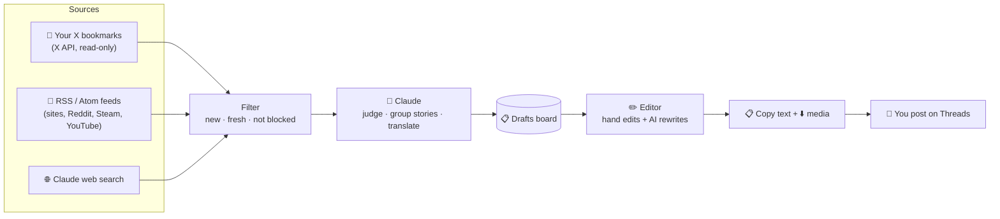

<div align="center">

# 🎮 Content Machine

**Turn your X bookmarks and the latest gaming news into ready-to-post Russian Threads posts, with Claude doing the heavy lifting.**

You pick what's worth sharing. Claude finds the news, writes the post in Russian and keeps everything tidy. You review, tweak, copy and post.


[Features](#-features) · [How it works](#-how-it-works) · [Quick start](#-quick-start) · [Daily workflow](#-daily-workflow) · [Configuration](#%EF%B8%8F-configuration) · [Troubleshooting](#-troubleshooting)

</div>

---

## ✨ Features

- **🔖 X bookmarks → drafts.** Scroll X like you always do and bookmark what you like. One click imports the new bookmarks, and Claude works out which game each post is about and writes the Russian version.
- **📰 Free news discovery.** For every game you track, the app reads RSS feeds (gaming sites, subreddits, Steam news, YouTube channels) and runs a Claude web search. Claude keeps only real news, merges duplicates of the same story and skips what you already have.
- **✍️ An editor that helps.** Edit by hand, or ask the AI: *“Сделай короче”*, *“make it sound like breaking news”*, *“add context for people who don't follow the game”*. Every change is saved as a version you can go back to.
- **📋 Built for posting by hand.** Each draft has a 500-character counter (Threads' limit), **Copy text**, **Download media** (all images and videos as one zip) and **Mark posted**.
- **🧠 AI on your Claude subscription.** By default the AI runs through Claude Code on your own computer, so there's no per-token API bill.
- **🔒 Local and private.** Your drafts, settings and media stay in a SQLite file on your machine. Nothing is ever posted for you.

> [!NOTE]
> Content Machine **never posts anything** on X or Threads. Publishing stays in your hands, which keeps your accounts safe from automation bans.

---

## 🧭 How it works



| Step | What happens |
|---|---|
| **1. Collect** | **Import bookmarks** pulls your newest X bookmarks and stops at the first one it already has. **Find news** reads your feeds and asks Claude to search the web for each game. |
| **2. Filter** | Duplicates, items already seen, items older than your limit and anything on your blocklist are dropped. |
| **3. Judge & translate** | Claude rates each item 1–10, groups items about the same story, and writes a short Russian post in your style. Bookmarks are always kept, because you chose them. |
| **4. Review** | Drafts appear on the board with the original, the Russian text, media and Claude's reason for picking it. |
| **5. Post** | Polish the text in the editor, copy it, download the media, post on Threads yourself and mark it as posted. |

---

## 💸 What it costs

| Part | Cost |
|---|---|
| 🧠 AI (translation, judging, edits, web search) | **Included in your Claude plan.** Uses your plan's monthly Agent SDK credit |
| 📰 RSS feeds | **Free** |
| 🔖 X bookmark import | **~$0.001 per bookmark** from X API credits. New X developer accounts get $20 in free credits |
| 🔎 Paid X search *(optional, off by default)* | ~$0.005 per post read |

Importing 300 bookmarks a month costs about **$0.30**.

---

## 📦 Requirements

| | |
|---|---|
| **Computer** | macOS, Linux or Windows (WSL recommended) |
| **Node.js** | **22 or newer** (check with `node -v`) |
| **Claude Code** | Installed and logged in with a Claude subscription (Pro or Max). See the [Claude Code docs](https://code.claude.com/docs) |
| **X developer account** | Optional, only needed for bookmark import ([console.x.com](https://console.x.com)) |

---

## 🚀 Quick start

### 1. Get the code

```bash
git clone https://github.com/RamazanBolatkhan/content-machine.git
cd content-machine
npm install
```

### 2. Make sure Claude Code is ready

```bash
claude --version   # should print a version
claude             # run once and log in with your Claude account, then exit
```

### 3. Create your config file

```bash
cp .env.example .env.local
```

The defaults already use Claude Code, so you can leave the file as it is for now.

### 4. Start the app

```bash
npm run dev
```

Open **[http://127.0.0.1:3000](http://127.0.0.1:3000)**. Open **Settings**: under *Connections* it should say **✅ Claude Code on your subscription**.

> [!TIP]
> Always open the app at `127.0.0.1:3000`, not `localhost:3000`. X login only accepts the exact address you register.

The database (`data/app.db`) is created automatically on first start.

---

## 🔖 Connect X (for bookmarks)

This step is optional. Without it, you can still use **Find news**.

1. Go to **[console.x.com](https://console.x.com)**, sign in, accept the developer terms and create an **App**.
2. Open the app's **User authentication settings** and set:

   | Setting | Value |
   |---|---|
   | App permissions | **Read** |
   | Type of app | **Native App** *(or Web App, if you also copy the Client Secret)* |
   | Callback URL | `http://127.0.0.1:3000/api/x/callback` |
   | Website URL | anything, e.g. your X profile link |

3. Copy the **OAuth 2.0 Client ID** into `.env.local`:

   ```bash
   X_CLIENT_ID=your_client_id
   # X_CLIENT_SECRET=only_for_web_app_type
   ```

4. Add some API credits in the console. Bookmark reads are billed per post.
5. Restart `npm run dev`, then go to **Settings → Connect X account** and approve.

The app asks only for read access: `tweet.read`, `users.read`, `bookmark.read`, plus `offline.access` to stay logged in.

---

## 🎯 Add your games

Go to **Settings → Games to track** and add one card per game.

| Field | What to put in | Example |
|---|---|---|
| **Game** | The name | `GTA 6` |
| **Keywords** | Names people use for it, one per line. Used by web search and to match general news feeds | `GTA 6`<br>`GTA VI`<br>`Grand Theft Auto VI` |
| **Feeds** | RSS/Atom feeds that are *only* about this game, one per line | see below |

**Feed recipes:**

| Source | Feed URL |
|---|---|
| Subreddit (top of the day) | `https://www.reddit.com/r/<SUBREDDIT>/top/.rss?t=day` |
| Steam news for a game | `https://store.steampowered.com/feeds/news/app/<APP_ID>` *(the number in the game's Steam URL)* |
| YouTube channel | `https://www.youtube.com/feeds/videos.xml?channel_id=<CHANNEL_ID>` |
| Most blogs / WordPress sites | `https://<site>/feed` |

Under **Settings → Sources → General news feeds**, add gaming sites that cover many games (e.g. `https://www.gematsu.com/feed`). Their articles are matched to your games by keyword.

---

## 📅 Daily workflow

1. **Scroll X** as usual and **bookmark** posts worth sharing.
2. Open the **Drafts** board and press:
   - **📥 Import bookmarks** to turn your new bookmarks into drafts.
   - **📰 Find news** to collect fresh news for all games, or pick one game from the list.

   A run takes about 30–60 seconds per game.
3. Go through the **New** tab. Every card shows the game, the source, Claude's importance score (⭐ 1–10) and why Claude picked it.
4. Click **✏️ Open editor** on a good one:
   - Edit by hand, or use the quick buttons (*Сделай короче*, *Убери эмодзи*…) or your own request.
   - Use **Version history** to go back to any earlier version.
5. **📋 Copy text**, **⬇️ Download media**, post on Threads, and press **📤 Mark posted**.

> [!TIP]
> Credit the original author or outlet in your post (e.g. *“Источник: @RockstarGames”*). The editor reminds you of the right name.

### Run it on a timer (optional)

```bash
npm run scout:loop -- 240   # import bookmarks + find news every 240 minutes
```

This keeps running while the terminal window is open.

---

## ⚙️ Configuration

### Environment (`.env.local`)

| Variable | Default | What it does |
|---|---|---|
| `AI_PROVIDER` | `claude-code` | `claude-code` uses your local Claude Code (subscription). `gateway` uses [Vercel AI Gateway](https://vercel.com/ai-gateway) (paid per token) |
| `CLAUDE_MODEL` | `sonnet` | Claude Code model alias: `sonnet`, `opus` or `haiku` |
| `CLAUDE_BIN` | auto-detected | Path to `claude`, only if the app can't find it |
| `AI_GATEWAY_API_KEY` | – | Only when `AI_PROVIDER=gateway` |
| `AI_MODEL` | `anthropic/claude-sonnet-5.5` | Gateway model, only when `AI_PROVIDER=gateway` |
| `X_CLIENT_ID` | – | OAuth 2.0 Client ID of your X app (for bookmarks) |
| `X_CLIENT_SECRET` | – | Only for X apps of type *Web App* |
| `X_REDIRECT_URI` | `http://127.0.0.1:3000/api/x/callback` | Change it if you run on another port |
| `X_BEARER_TOKEN` | – | Only for the optional paid X search |

### In-app settings

| Section | Settings |
|---|---|
| **Sources** | Turn RSS, Claude web search and paid X search on or off. Set the max bookmarks per import, ignore news older than N hours, and set the max items per game sent to the AI |
| **Writing & filters** | **Style** (how your Russian posts should sound), **Glossary** (terms never translated, e.g. `PS5`, `early access`), **Blocklist** (words or `@handles` to always skip) |
| **Recent runs** | A log of every import and news run, with warnings such as a broken feed |

> [!NOTE]
> Posts are written in **Russian**. To target another language, change the rules in `translationRules()` in [`src/lib/ai.ts`](src/lib/ai.ts) and your style text in Settings.

---

## 🧰 Commands

| Command | What it does |
|---|---|
| `npm run dev` | Start the app at `http://127.0.0.1:3000` |
| `npm run build` / `npm start` | Production build and run (still local) |
| `npm run scout:loop -- <minutes>` | Collect automatically on a timer |
| `npm run typecheck` | TypeScript check |
| `npm run lint` | ESLint |
| `npm run db:generate` | Create a migration after changing `src/db/schema.ts` |
| `npm run x:check -- "<query>"` | Test the optional paid X search connection |

---

## 🗂️ Project structure

```
content-machine/
├── src/
│   ├── app/                    # Pages (Drafts, Editor, Settings) + API routes
│   │   ├── api/x/              #   X login (OAuth) + callback
│   │   └── api/drafts/[id]/    #   AI edit + media zip
│   ├── components/             # Board buttons, editor, media grid…
│   ├── db/schema.ts            # SQLite tables (Drizzle ORM)
│   └── lib/
│       ├── agents/scout.ts     # Collect → filter → judge → save
│       ├── agents/editor.ts    # AI rewrites in the editor
│       ├── claude-cli.ts       # Runs `claude -p` on your subscription
│       ├── ai.ts               # AI provider switch + translation rules
│       ├── sources/            # RSS reader, Claude web search
│       └── x/                  # X OAuth, bookmarks, optional search
├── scripts/                    # scout-loop, x-check
├── drizzle/                    # Database migrations (applied automatically)
├── docs/PROJECT_SCHEME.md      # Design notes and decisions
└── data/                       # Your database + media (git-ignored)
```

---

## 🩺 Troubleshooting

<details>
<summary><b>Settings says “Claude Code CLI not found”</b></summary>

Install Claude Code and run `claude` once to log in. If it's installed in an unusual place, find it with `which claude` and add the path to `.env.local`:

```bash
CLAUDE_BIN=/full/path/to/claude
```
Then restart `npm run dev`.
</details>

<details>
<summary><b>“Claude error … usage limit” during a run</b></summary>

Your plan's monthly Agent SDK credit is used up, or you've hit a rate limit. Wait for it to reset, lower **Max news items per game**, or turn off **Claude web search** for a while (RSS keeps working).
</details>

<details>
<summary><b>X login fails or says the callback URL doesn't match</b></summary>

- Open the app at **`http://127.0.0.1:3000`**, not `localhost`.
- The callback URL in the X console must be exactly `http://127.0.0.1:3000/api/x/callback`.
- *Native App* type: set only `X_CLIENT_ID`. *Web App* type: also set `X_CLIENT_SECRET`.
- Restart `npm run dev` after changing `.env.local`.
</details>

<details>
<summary><b>Bookmark import fails with 402 / 403</b></summary>

Your X developer account has no credits left, or the app lacks read permission. Add credits in [console.x.com](https://console.x.com), check **App permissions → Read**, then use **Disconnect** and **Connect X account** again in Settings.
</details>

<details>
<summary><b>A feed shows “429 Too Many Requests” or another error</b></summary>

The site refused the request for now, which is common with Reddit. Only that feed is skipped for the run, and the next run usually works. A permanent error means the URL isn't an RSS/Atom feed; open it in a browser to check.
</details>

<details>
<summary><b>“Find news” finds nothing new</b></summary>

That usually means there's no fresh news. To get more:
- add more feeds,
- add more keywords for the game,
- or raise **Ignore news older than**.

Items Claude already judged are never shown again.
</details>

<details>
<summary><b>I want to start over with an empty database</b></summary>

Stop the app and delete the `data/` folder. It's created again on the next start. This deletes all drafts and settings.
</details>

---

## 🛡️ Responsible use

- **No scraping.** Content from X comes only through the official X API, and only from **your own bookmarks**. X's terms forbid scraping, and it risks your account.
- **Credit your sources.** Rewrite the news in your own words and name the original author or outlet.
- **Personal use of your Claude subscription.** The `claude-code` provider runs Claude Code under your own account, for your own use. If other people use your setup (e.g. a hosted version), switch to `AI_PROVIDER=gateway` with an API key.
- **Check before posting.** Claude marks rumors as rumors and is told not to invent facts. Still read each draft before it goes live.

---

## 🧱 Built with

[Next.js 16](https://nextjs.org) · [React 19](https://react.dev) · [Tailwind CSS 4](https://tailwindcss.com) · [Drizzle ORM](https://orm.drizzle.team) + SQLite · [Claude Code](https://code.claude.com/docs) · [AI SDK](https://ai-sdk.dev) · [X API v2](https://docs.x.com)

---

<div align="center">

Made for gaming news creators who'd rather pick great stories than copy-paste all day. 🎮

</div>
