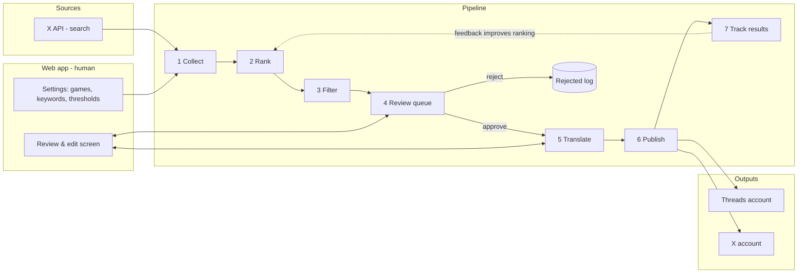

# Content Machine — Project Scheme

> Status: **v3 built: AI news in 6 languages** (bookmarks + free news, AI on the Claude subscription). Sections 13 (sources, AI, pipeline) + 14 (AI-news + multilingual changes) are the current design. Sections 1–12 are history.
> Last updated: 2026-10-06

## 1. The idea in one paragraph

The owner runs a gaming-news content account. Today the workflow is manual:
search X for posts about the games they care about → find the most popular ones →
filter out noise → hand-pick the good ones → translate them (Russian + a second
language, see open questions) → publish on their own **Threads** (and possibly **X**) accounts.

**Content Machine** automates everything except taste: the machine collects, ranks,
pre-filters, translates and publishes; **the human only approves or rejects** in a
simple web app.

## 2. Current manual workflow → what gets automated

| # | Manual step today                         | In Content Machine                                   | Who      |
|---|-------------------------------------------|------------------------------------------------------|----------|
| 1 | Search X for tracked games                | Scheduled collector queries X API per game/keyword   | Machine  |
| 2 | Find the most popular posts               | Engagement score + velocity ranking                  | Machine  |
| 3 | Filter out junk                           | Rules + AI relevance/quality filter                  | Machine  |
| 4 | Pick the ones I like                      | Review queue in web app (approve / reject / edit)    | **Human**|
| 5 | Translate                                 | AI translation with gaming glossary, editable draft  | Machine → Human can edit |
| 6 | Post to Threads / X                       | Publisher, immediately or on a schedule              | Machine  |

## 3. Big-picture scheme

```
                ┌──────────────────────────── CONTENT MACHINE ─────────────────────────────┐
                │                                                                           │
 ┌─────────┐    │  ┌────────────┐   ┌────────────┐   ┌────────────┐   ┌──────────────────┐  │
 │  X API  │───────▶ 1.COLLECT  │──▶│ 2. RANK    │──▶│ 3. FILTER  │──▶│ 4. REVIEW QUEUE  │  │
 │ (search)│    │  │ per game,  │   │ likes, RTs,│   │ dedupe,    │   │  (web app)       │  │
 └─────────┘    │  │ on a cron  │   │ views,     │   │ language,  │   │  ✅ approve      │  │
                │  │            │   │ velocity   │   │ AI quality │   │  ❌ reject       │  │
                │  └────────────┘   └────────────┘   └────────────┘   │  ✏️ edit         │  │
                │        ▲                                            └────────┬─────────┘  │
                │        │ tracked games, keywords,                            │ approved   │
                │        │ accounts, thresholds                                ▼            │
                │  ┌─────┴──────┐                                     ┌──────────────────┐  │
                │  │  SETTINGS  │                                     │ 5. TRANSLATE     │  │
                │  │ (web app)  │                                     │ AI + glossary    │  │
                │  └────────────┘                                     │ RU + 2nd lang    │  │
                │                                                     └────────┬─────────┘  │
                │  ┌────────────────────────┐                                  │ final text │
                │  │  DATABASE              │◀──── every step reads/writes ────┤            │
                │  │  posts, scores, status,│                                  ▼            │
                │  │  translations, history │                         ┌──────────────────┐  │    ┌─────────────┐
                │  └────────────────────────┘                         │ 6. PUBLISH       │──────▶│ Threads API │
                │  ┌────────────────────────┐                         │ now / scheduled  │  │    └─────────────┘
                │  │  MEDIA STORAGE         │◀── images/video ───────▶│ + media re-host  │──────▶┌─────────────┐
                │  │  (re-hosted files)     │                         └────────┬─────────┘  │    │  X API      │
                │  └────────────────────────┘                                  │            │    │  (post)     │
                │                                                              ▼            │    └─────────────┘
                │                                                     ┌──────────────────┐  │
                │                                                     │ 7. TRACK RESULTS │  │
                │                                                     │ likes/views back │  │
                │                                                     └──────────────────┘  │
                └───────────────────────────────────────────────────────────────────────────┘
```

### Same flow as a Mermaid diagram



## 4. Post lifecycle (status machine)

Every X post found becomes one row in the database and moves through these statuses:

```
collected → ranked → filtered_out
                   ↘ in_queue → rejected
                              ↘ approved → translating → ready → scheduled → published → tracked
                                                                           ↘ failed (retry)
```

## 5. Components in detail

### 5.1 Settings (what to watch)
- **Tracked games**: name, keywords/hashtags, official accounts, trusted insiders/leakers.
- **Thresholds**: min likes/reposts/views, max post age (e.g. last 24h), languages to accept.
- **Blocklist**: accounts or words to always skip (spoilers, NSFW, drama, ads).
- **Target accounts**: which Threads / X account each language goes to.

### 5.2 Collector
- Runs on a schedule (e.g. every 30–60 min) per game.
- Uses X API search with operators like `(GTA6 OR "GTA VI") -is:retweet min_faves:...` (`min_faves` depends on API tier).
- Saves raw post: text, author, metrics, media URLs, links, timestamp.
- **Dedupe** by post ID and by near-identical text, since the same news gets reposted by 20 accounts.

### 5.3 Ranker
- `score = weighted(likes, reposts, quotes, views) / age` → favors *fast-rising* posts, not just old viral ones.
- Bonus for trusted/official accounts.
- Later: learn from what the owner approved and from how published posts performed (feedback loop).

### 5.4 Filter (rules + AI)
- Rules: language, minimum length, has media, not a reply, not on the blocklist.
- AI check (cheap LLM call): "Is this real news/interesting content about game X? Is it spam/meme/drama?" → gives a label and a confidence score.
- Groups duplicates of the same story so the owner sees **one story, best source**.

### 5.5 Review queue (the core screen of the web app)
- Card per post: original text, media preview, metrics, score, source link, AI translation preview.
- Actions: **Approve**, **Reject**, **Edit translation**, **Schedule**, **Skip for now**.
- Keyboard shortcuts for fast triage (e.g. `A`/`R`/`E`).
- Mobile-friendly so it can be done from the phone.

### 5.6 Translator
- LLM translation, not literal: natural tone for a gaming audience.
- **Glossary**: game names, studios and terms that must not be translated (e.g. "GTA VI", "trailer", "patch notes" rules).
- Style prompt: tone, emoji usage, hashtags, length limit per platform (Threads 500 chars, X 280 for non-Premium accounts).
- Optional: add a source credit line ("Source: @author").
- The human can edit before publishing; edits are saved and can improve future prompts.

### 5.7 Publisher
- **Threads API** (Meta Graph API): two steps, create a media container then publish it. Media must be at a public URL, so it's re-hosted in our storage first. Has a posting limit per 24h.
- **X API**: post tweet + upload media.
- Modes: publish now / add to a schedule queue (e.g. spread posts through the day).
- Retries on failure and logs the result (post URL on the target platform).

### 5.8 Results tracker
- Pulls likes/views for our published posts after 1h / 24h.
- Dashboard: which games/types of post perform best → feeds back into ranking.

## 6. Accounts & connections needed

| Connection        | Purpose                     | Notes |
|-------------------|-----------------------------|-------|
| X developer app   | Read/search posts (+ post)  | **Paid**: reading/search requires a paid tier or pay-per-use credits. Check current pricing before building; this is the main running cost. |
| Threads (Meta) app| Publish to Threads          | Needs Meta developer app, Threads API permissions (`threads_basic`, `threads_content_publish`), OAuth login of the Threads account. |
| LLM provider      | Filter + translate          | Cheap model for filtering, stronger model for translation. |
| Database          | Store everything            | Postgres. |
| File storage      | Re-host images/videos       | Needed for Threads (public URL). |

## 7. Suggested tech stack (default, can change)

- **Web app + API**: Next.js (App Router) on Vercel.
- **Scheduled jobs**: Vercel Cron → collector / publisher / tracker endpoints (or Vercel Workflow for multi-step durable jobs).
- **Database**: Postgres (Neon via Vercel Marketplace) + Drizzle/Prisma ORM.
- **Media storage**: Vercel Blob.
- **AI**: AI SDK through Vercel AI Gateway (Claude models), with structured output for filter labels. AI connects to X via MCP. See section 11.
- **Auth**: single-owner login (simple; it's a personal tool).

## 8. Build phases (when we start building)

1. **MVP: collect + review.** Settings for games, X collector, ranking, review queue. No auto-posting yet; just "copy translation" button.
2. **Translate.** AI translation with glossary + editing in the queue.
3. **Publish to Threads.** OAuth connect, media re-hosting, publish now / schedule.
4. **Publish to X** (optional, depending on API cost).
5. **Feedback loop.** Results tracking, dashboard, smarter ranking.

## 9. Risks & things to keep in mind

- **X API cost & limits**: biggest constraint; design the collector to minimize requests (batch keywords, cache, sensible intervals).
- **Copyright / platform rules**: reposting others' content and media. Always keep a source credit, and prefer rewriting/summarizing news over copying verbatim.
- **Threads posting limits** and **X spam rules**: don't flood; use the schedule queue.
- **Translation quality** for slang/memes: always human-approved before posting.

## 10. Open questions (confirm with owner)

- [ ] **Second target language**: the request said "Russian and Apple", which is probably a voice-typing error. English? Kazakh? Uzbek?
- [ ] One Threads account with both languages, or separate accounts per language?
- [ ] Post to X too, or Threads only?
- [ ] Which games to track first?
- [ ] Budget for X API per month?
- [ ] Fully manual approval forever, or auto-publish for very high-score posts later?

## 11. AI agent + MCP design (chosen direction, 2026-10-06)

**Main rule: AI does the judgment work, plain code does the risky or repeated work.**
AI finds, picks, translates and rewrites. Publishing is a normal button in the app
that calls the Threads/X API directly, and the AI is **never** given a "publish" tool.

```
┌──────────────────────────── WEB APP (Next.js) ────────────────────────────┐
│                                                                           │
│  [Drafts board]  cards: original post · RU · 2nd lang · score · media     │
│        │                                                                  │
│        ├── ✏️ edit text by hand ───────────────────────┐                  │
│        ├── 💬 "make it shorter / more hype / add       │                  │
│        │       context" → chat panel ──▶ EDITOR AGENT ─┘ (new version)    │
│        ├── ❌ reject                                                       │
│        └── ✅ Publish / Schedule ──▶ PUBLISHER (plain code, no AI)        │
│                                          │                                │
└──────────────────────────────────────────│────────────────────────────────┘
                                           ▼
       SCOUT AGENT (cron, every 30–60 min) │            Threads API / X API
       ┌────────────────────────────────┐  │
       │ Claude + MCP client            │  │
       │  tools: X MCP (search, get     │  │
       │  post, get user) via allowlist │  │
       │ → finds & ranks posts          │  │
       │ → filters, groups duplicates   │  │
       │ → translates RU + 2nd lang     │  │
       │ → saves DRAFTS to database     │  │
       └──────────────┬─────────────────┘  │
                      ▼                    │
                 ┌──────────┐              │
                 │ Postgres │◀─────────────┘ (status, versions, results)
                 └──────────┘
```

### Agents
| Agent | Runs when | Tools | Output |
|-------|-----------|-------|--------|
| **Scout** | Scheduled (cron) or "Find now" button | X MCP, **read-only** allowlist (search recent posts, get post, get user) + `save_draft` | Structured drafts in DB |
| **Editor** | User types in a draft's chat panel | `get_draft`, `update_draft`; optionally X MCP read to fetch more context | New draft version, streamed into the editor |
| **Publisher** | User clicks Publish / schedule fires | None. Not an AI agent, just code | Post URL saved to DB |

### MCP connections
- **X**: official XMCP, hosted at `https://api.x.com/mcp` (or self-hosted from `github.com/xdevplatform/xmcp`). Restrict tools with `X_API_TOOL_ALLOWLIST` to read-only. Still billed as normal X API usage.
- **Threads**: Meta has no MCP server of its own, only community ones. Plan: **call the Threads API from our own code** (create container → publish; ~3 small functions). This is safer than handing account tokens to a third-party server. Add a Threads MCP later only if the AI needs to *read* Threads (e.g., performance stats).

### Draft data (what the board shows)
`source_post_id, source_url, author, game, original_text, media[], metrics, score,
ai_reason ("why this is worth posting"), translations{ru, lang2}, versions[], status`.
Each AI or hand edit creates a new version, so changes can be undone.

### Implementation choices
- AI SDK 7 in Next.js: MCP client → X tools, `generateObject`/structured output for drafts, streaming for the editor chat.
- Scout as a Vercel Cron route (or a Vercel Workflow if runs get long/multi-step).
- Alternative: the Claude Agent SDK, which has built-in MCP support. Pick one when building starts.

## 12. v1: what is built and the owner's decisions (2026-10-06)

**Decisions that override earlier sections:**
- **Russian only.** No second language.
- **No auto-publishing.** The owner posts to Threads by hand because of ban risk. The app's output is **Copy text + Download media + Mark posted**. Sections 5.7/6 about Threads/X publishing are *not* built and not planned for now.
- **Local first.** Runs on the owner's Mac with SQLite; deploy to Vercel later (then: Postgres, Blob, auth, Vercel Cron).

**Code map:**
| Path | What |
|------|------|
| `src/db/schema.ts`, `drizzle/` | SQLite schema (games, settings, drafts, draft_versions, scout_runs, seen_posts) + migrations (auto-applied on first DB use) |
| `src/lib/x/client.ts` | X access: `X_MODE=mcp` (official XMCP, `searchPostsRecent`/`getPostsByIds`) or `direct` (X API v2). Read-only allowlist for AI tools |
| `src/lib/x/parse.ts` | Normalizes X API v2 JSON (also when wrapped in MCP results) into `XPost` |
| `src/lib/agents/scout.ts` | Fetch → code filters/score → one AI call judges + translates + groups stories → saves drafts + media |
| `src/lib/agents/editor.ts` | Streams AI rewrites of a draft (with read-only X MCP tools), saves as `ai_edit` version |
| `src/app/page.tsx` | Drafts board (status/game filters, "Find posts now") |
| `src/app/drafts/[id]/page.tsx` + `src/components/DraftEditor.tsx` | Editor: manual edit, AI chat, version history, copy, media zip |
| `src/app/settings/page.tsx` | Games, thresholds, blocklist, glossary, style, run log |
| `scripts/x-check.ts`, `scripts/scout-loop.ts` | Check X connection / run scout on a timer |

**Not verified yet:** real calls to X MCP and AI Gateway, because the owner had no keys at build time. The first run with real keys may need small fixes in how `searchPostsRecent` arguments are passed (`npm run x:check -- "GTA 6" --schema` prints the tool's input schema).

## 13. v2: near-zero cost design (2026-10-07), current

**Why:** the owner doesn't want to pay for X search (~$0.005/post) or AI tokens. Scraping X was rejected because X's terms forbid it and it risks an account ban.

**Sources:**
| Source | How | Cost |
|---|---|---|
| 🔖 X bookmarks | Owner bookmarks posts while scrolling X; app reads them via X API OAuth 2.0 (PKCE, read-only scopes). Stops at the first already-known bookmark | ~$0.001/post ("owned reads") |
| 📰 RSS/Atom | Per-game feeds (subreddit .rss, Steam news, YouTube) + general news feeds matched by keywords | free |
| 🌐 Web search | `claude -p` with WebSearch, per game | Claude subscription |
| 🔎 Paid X search | Old v1 path (XMCP/direct), **off by default** | ~$0.005/post |

**AI:** `AI_PROVIDER=claude-code` (default) runs the local Claude Code CLI (`claude -p --json-schema …`) on the owner's subscription (personal use; draws from the plan's Agent SDK credit). The child process runs in `data/claude-work` with no settings or MCP, and with `ANTHROPIC_API_KEY` removed from its env so it never bills the API. `AI_PROVIDER=gateway` keeps the paid AI SDK path.

**Pipeline** (`src/lib/agents/scout.ts`):
- **Bookmarks** (`syncBookmarks`): `importCuratedPosts` turns every post into a draft. The AI picks the game, importance (1–10) and Russian text.
- **News** (`findNews`): per game, gather RSS + web (+ paid X) → de-duplicate by normalized URL, drop known/old/blocked, newest first, cap → AI judges keep/importance/storyKey/text in batches of 10 → best item per new story saved, og:image fetched for news without a picture.
- Everything judged goes into `seen_items` so the AI never sees it twice.

**Code map changes vs. v1:** `src/lib/claude-cli.ts` (CLI runner), `src/lib/ai.ts` (`aiObject`/`aiText`, provider switch), `src/lib/x/auth.ts` + `src/app/api/x/{login,callback}` (OAuth), `src/lib/x/bookmarks.ts`, `src/lib/sources/{rss,web-search,types}.ts`, `src/components/CollectButtons.tsx`, `SourceBadge.tsx`. Drafts are source-agnostic (`sourceId` = `x:<id>` or `url:<normalized url>`, `source`, `sourceName`, nullable `metrics`, `score` = AI importance).

**Verified 2026-10-07:** RSS (Reddit, Gematsu, Steam), Claude web search → 2 Russian drafts with images in 33 s, AI edit via the editor (4 s, saved as a version), bookmark AI path with a sample post (game detected). **Not verified yet:** the real X OAuth login and bookmarks API call (owner has no X app credentials yet).

## 14. v3: AI news, six languages (2026-10-07), current

**Why:** the owner switched from gaming news in Russian to **AI news** for a **multilingual audience**.

**Changes vs. v2:**
- **Games → topics** (`topics` table, `topicId` on drafts/runs). Topics are companies, products or themes (OpenAI, open-source models, AI agents…). Prompts, web search and examples target AI news.
- **Languages:** `src/lib/languages.ts` lists zh (Simplified), ko, ja, ru, es (neutral), pt (Brazilian). Settings stores enabled `languages` (default: all) and `charLimit` (default 500 = Threads).
- **Pipeline split:** the scout's **judge** call now only decides keep/topic/importance (1–10)/storyKey/reason (in English). A separate **writer** (`src/lib/agents/writer.ts`) writes the post in every enabled language, 3 items per AI call, with a zod schema built from the enabled languages. Items whose writing fails are not marked seen, so they are retried.
- **Versions per language:** `draft_versions` has `lang` + `text`. The editor has language tabs, keeps unsaved edits per tab, does AI edits per language (the instruction can be in any language, the output stays in the tab's language), and offers **Write missing languages** (`writeMissingLanguages`).
- **Tested feeds** for AI news are listed in README (OpenAI, DeepMind, Google AI, Hugging Face, r/LocalLLaMA, TechCrunch AI, The Verge AI, MIT Tech Review, hnrss). Anthropic has no RSS; web search covers it.

**Verified 2026-10-07:** topic "OpenAI" with the OpenAI RSS feed, TechCrunch AI and web search → 3 drafts in 70 s, each in all 6 languages within 500 chars, with sensible importance scores. Japanese AI edit with an English instruction stayed in Japanese (4 s). Write-missing-languages refilled a deleted Korean version. All pages render. **Still not verified:** the real X OAuth login and bookmarks call.
